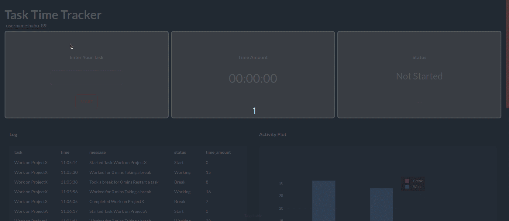

# Time Tracking Application

## Demo
[Demo Video Link](https://www.youtube.com/watch?v=WoisN8UZmvw)
## Description

Task and time management app with Taipy and Kintone.

## Setting up Kintone as a Backend

1. Make a developer account
2. Create an application with username, time, task, date, status, time_amount
3. Generate API access token.
4. Add your credentials to the .env file according to the env.sample file.

## How to run the application locally

1. Set up your venv for this project
2. Run Command `pip install -r requirements.txt
`
3. Run `python3 src/main.py` or `python src/main.py`, `taipy run src/main.py` for debug-mode
4. A window should have launched at 127.0.0.1:5001

## Background

This application was created for [MLH's Month Long Hackaton](https://mlh-s-month-long-hackathon.devpost.com/) January 2024 by Rad, David, and Satoshi.

We won the prize of "Best use of Kintone" with this project!!

[Project Post](https://devpost.com/software/time-tracking-application)
